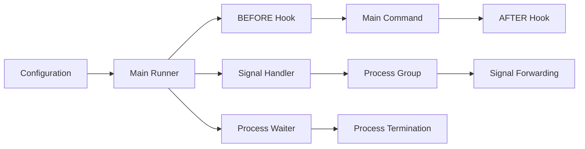

# binit 🔄

## Description 📝

Binit is a process supervisor that manages the execution of programs with
pre/post execution hooks, signal handling, and process group management. It's
designed to be a lightweight, reliable process supervisor for containerized
environments and system services.

## Features ✨

- **Pre/Post Execution Hooks**: Run commands before and after the main program
- **Signal Forwarding**: Properly handles signals for process groups
- **Process Group Management**: Creates and manages process groups for clean
  signal handling
- **Environment Variable Injection**: Pass environment variables to executed
  commands
- **Graceful Shutdown**: Proper cleanup and exit code handling
- **Cross-Platform**: Works on Unix-like systems with proper signal support
- **Configuration via Environment Variables**: Easy integration with
  containerized environments

## Architecture Overview 🏗️

Binit follows a clean, modular architecture with clear separation of concerns:

### Core Components 🧩

**Main Runner** (`run.go`)
- Orchestrates the execution flow
- Manages the main command lifecycle
- Handles configuration and environment setup

**Command Executor** (`command.go`)
- Executes shell commands with proper environment handling
- Supports shell argument parsing with `go-shellquote`
- Handles stdin/stdout/stderr redirection

**Signal Handler** (`signal.go`)
- Manages process group signal forwarding
- Handles `PRE_STOP_SIGNAL` signals by executing the `PRE_STOP` command and
  then forwarding the signal to the process group for normal termination
  handling
- Supports `SKIP_SIGNAL_LOG` configuration

**Process Waiter** (`wait.go`)
- Monitors child processes for termination
- Implements proper process group cleanup
- Handles graceful shutdown scenarios

### Component Interactions 🔄



The system starts with configuration parsing, creates a main runner that
executes the BEFORE hook, starts the main command in a process group, sets up
signal handling, and manages process lifecycle through the waiter.

### Loading Mechanism 📥

The binit utility follows a straightforward execution pattern:
1. Parse environment variables into `Config` struct
2. Execute BEFORE hook command if configured
3. Start main command in process group
4. Set up signal handling for process group
5. Execute main command and wait for termination
6. Execute AFTER hook command if configured
7. Return exit code from main command

### Command-Line Interface 🖥️

Binit is configured entirely through environment variables, making it ideal for
containerized environments:

```bash
# Basic usage - run a command with hooks
BEFORE="echo 'Starting...'" \
AFTER="echo 'Done.'" \
WORKDIR="/app" \
binit /usr/bin/myapp

# With signal handling
BEFORE="echo 'Starting...'" \
PRE_STOP="cleanup.sh" \
PRE_STOP_SIGNAL="SIGTERM,SIGINT" \
SKIP_SIGNAL_LOG="SIGURG" \
binit /usr/bin/myapp
```

## Installation 📦

Use go to install the command:

```bash
go install github.com/flori/binit/cmd/binit@latest
```

## Examples 🎯

### Basic Usage

```bash
# Run a simple command with hooks
BEFORE="echo 'Before starting'" \
AFTER="echo 'After finishing'" \
binit /bin/sleep 60

# Run with working directory
WORKDIR="/opt/app" \
BEFORE="mkdir -p logs" \
binit /usr/bin/node server.js
```

### Advanced Usage

```bash
# With signal handling
PRE_STOP="cleanup.sh" \
PRE_STOP_SIGNAL="SIGTERM,SIGINT" \
SKIP_SIGNAL_LOG="SIGURG" \
binit /usr/bin/nginx

# Complex hook with environment variables
BEFORE="echo 'Setting up $MY_VAR...'" \
AFTER="echo 'Cleaning up...'" \
binit /usr/bin/python app.py
```

## Error Handling ⚠️

Binit handles errors gracefully:
- Configuration errors result in immediate exit with error code 1
- Command execution failures are logged and cause program termination
- Signal handling errors are logged but don't prevent program operation
- Process group management errors are handled with appropriate logging

## Performance Considerations ⚡

- Minimal overhead - only creates necessary goroutines and channels
- Efficient process group management
- Fast command execution with proper environment handling
- No external dependencies beyond standard Go libraries

## Platform Support 🌍

### Requirements
- Unix-like systems with proper signal support
- Go 1.19+ runtime
- Standard Unix system call support (`wait4`, `kill`, etc.)

### Features
- Process group creation and signal handling
- Proper signal forwarding to process groups
- Environment variable management
- Cross-platform compatibility for Unix systems

## Configuration ⚙️

Binit is configured entirely through environment variables:

| Environment Variable | Description |
|--|---|
| `BEFORE` | Command to run before main program |
| `AFTER` | Command to run after main program |
| `WORKDIR` | Working directory for main program |
| `PRE_STOP` | Command to run on `PRE_STOP` signals |
| `PRE_STOP_SIGNAL` | Comma-separated list of signals that trigger `PRE_STOP` |
| `SKIP_SIGNAL_LOG` | Comma-separated list of signals to not log |

### BINIT_ Environment Variables

The binit process supervisor defines several `BINIT_` prefixed environment
variables that are available to executed commands:

#### `BINIT_EXIT_CODE`
- **Description**: Contains the exit code of the main program
- **Usage**: Available in AFTER hooks and other post-execution commands
- **Example**: `BINIT_EXIT_CODE=0` (for successful execution)

#### `BINIT_CMD_PID`
- **Description**: Contains the process ID of the main command
- **Usage**: Available in `PRE_STOP` hooks when handling signals
- **Example**: `BINIT_CMD_PID=12345`

#### Variable Scope and Availability

These variables are set in the environment of:
1. **AFTER hooks** - contains `BINIT_EXIT_CODE`
2. **PRE_STOP hooks** - contains `BINIT_CMD_PID` when signal is received
3. **BEFORE hooks** - do not receive these variables (as no main command exists yet)

#### Example Usage

```bash
# BEFORE hook - no BINIT_ variables available
BEFORE="echo 'Starting application'" \
# PRE_STOP hook - BINIT_CMD_PID available
PRE_STOP="kill -TERM $BINIT_CMD_PID" \
PRE_STOP_SIGNAL="SIGTERM" \
# AFTER hook - BINIT_EXIT_CODE available
AFTER="echo 'Application exited with code: $BINIT_EXIT_CODE'" \
binit /usr/bin/myapp
```

#### Implementation Details

The variables are set by binit before executing hooks:
- `BINIT_EXIT_CODE` is set to the exit code of the main command
- `BINIT_CMD_PID` is set to the PID of the main command process
- These variables are injected into the environment of the hook commands using
  the `runCommandWithEnv` function

## Author 👨‍💻

Florian Frank <mailto:flori@ping.de>

## License 📄

Apache License, Version 2.0

See the [LICENSE](./LICENSE) file in the repository for full license
text.
